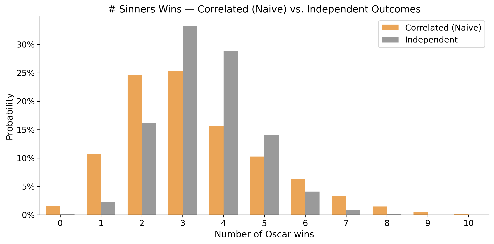
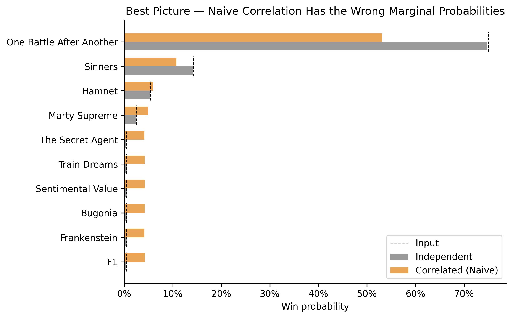
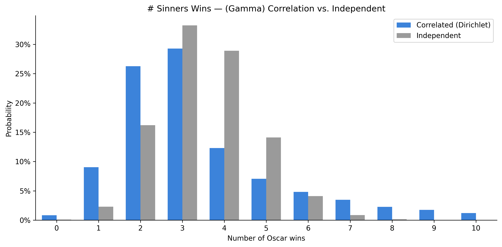
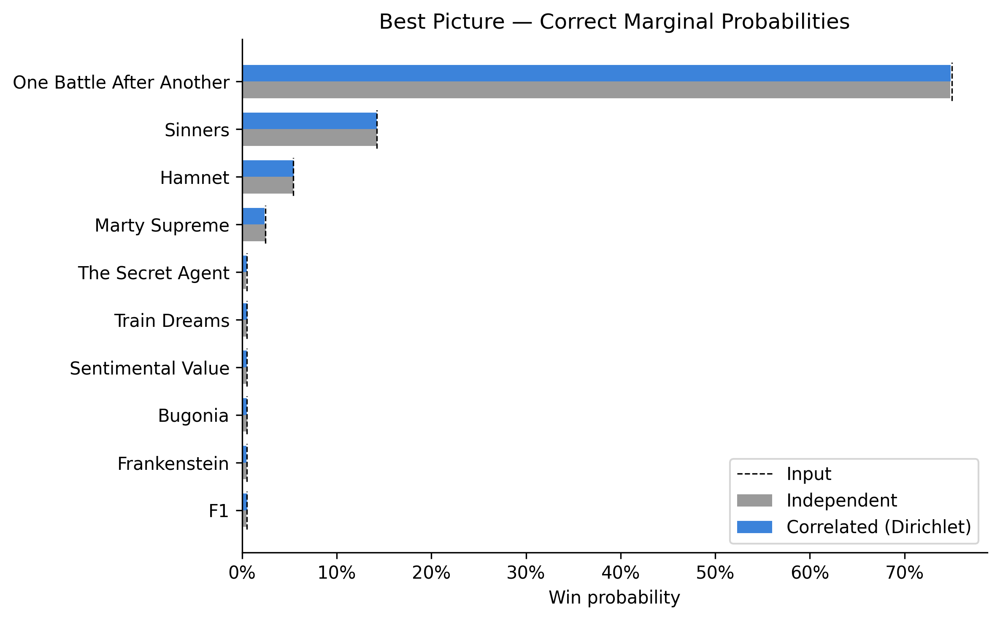

# Oscars Correlations

Consider three different questions you could ask when forecasting the Academy Awards:

1. What is the probability that film X wins award Y? (E.g., "One Battle After Another" (OBBA) has a ~70% chance to win Best Picture). 
2. Assuming that film X wins award Z, what is the probability it also wins award Y? (E.g., assuming OBBA wins Best Actor, it has an ~80% chance to win Best Picture). 
3. What is the probability that film X wins at least N awards? 

Question (1) is the fundamental task of Oscars prognostication. There is no shortcut here—forecasters need to use a patchwork of imperfect evidence (e.g., precursors, reporting, critical acclaim, box office) to predict the mercurial whims of the ~10,000 member Academy.

Question (2) is meaningfully different because Oscars outcomes are *correlated*. If I could peek into the future and see that Leonardo DiCaprio won Best Actor for OBBA (current probability ~10%), I would conclude that we had previously underestimated OBBA's popularity with the Academy, which might increase my confidence in its Best Picture chances (e.g., from 70% -> 80%).

This post builds a model for question (3) using the answers to (1) and (2). That is, how can we model the full probability distribution for a film's number of wins, given the probability that a film wins each individual award and the level of correlation between the outcomes?
# Naive model

Let $p_{i,j}$ denote the probability that film $i \in C_j$ wins category $j$. We want to generate a set of winners (one for each category) as a single simulated "Oscars night". If we repeat this process many times, we can answer like "What probability does OBBA have to win at least 6 Oscars?". 

The simplest approach is to separately generate the winners for each category.

**Model #1: Independent Outcomes**

1. **Generate winners**: Select winners independently in each category, using the $p_{i,j}$ probabilities

Under this approach, the winners are uncorrelated—i.e., if we repeat these simulations many times, in the simulations where OBBA wins Best Actor, it is no more or less likely to win Best Picture. This seems implausible.

How can we model what it means for winners to be correlated? One approach is to say that for each film, we under or overestimate its support among the Academy (meaning it has a higher or lower chance to win in *each* of its categories).

To operationalize this, the simulation needs additional steps. First generate a random $z_i$ as the "underestimation factor" for each film, use the $z_i$ to update the probabilities (from $p_{i,j} \to p_{i,j}'$), and then independently generate the winners using the updated $p_{i,j}'$ probabilities (which now encode the desired correlation).  

**Model #2: Correlated Outcomes (Naive)**

1. **Generate underestimation factors**: Generate a random $z_i \sim N(0, \sigma^2)$ for each film (where $\sigma$ is some scale parameter we choose to reflect the strength of the correlations)—roughly, "how much we underestimated its strength".
2. **Update probabilities**: Calculate the updated $p_{i,j}'$ for each film & category, by adding the underestimation factor to the original probability. That is, calculate $\alpha_{i,j} = p_{i,j} + z_i$, and then normalize the $\alpha_{i,j}$ so the probabilities sum to one:
$$p_{i,j}' = \frac{\alpha_{i,j}}{\sum_{f \in C_j} \alpha_{f,j}}.$$
3. **Generate winners**: Select winners independently in each category using the updated $p_{i,j}'$ probabilities.

When $z_i > 0$, we underestimated its support among the Academy, and it has a better chance to win in *each* of its categories, which induces the desired correlation. Under independent outcomes, Sinners is quite likely to win around ~4 awards (as it has many wholly independent shots at winning awards), whereas with these correlations, Sinners has a more plausible shot to win 5+ or 0. 
                                                                                                                                            
However, this approach is fatally flawed, as it fails to preserve the correct *marginal probabilities*. Once we normalize the probabilities, it asymmetrically advantages longshot nominees (e.g., a film starting at 1% can be hugely benefitted from its $z_i$ but its probability can't go much lower). Thus, F1 & Frankenstein are now vastly more likely to win Best Picture than the probabilities we assumed as input.

This is a non-starter, and it's non-trivial to fix. These $z_i$ perturbations are on a flat (percentage point) scale, which doesn't seem quite right (when a film might start at a baseline of 70% or 1%), but updating the probabilities using the log-odds or using a different $z_i$ distribution won't do much better. Instead, we need a way to perturb the probabilities on the correct scale so the marginals are preserved.
# How can we fix this?

**Setup**: The winner of each category is a draw from a [Multinomial distribution](https://en.wikipedia.org/wiki/Multinomial_distribution) (with $N=1$). The parameters for a Multinomial distribution are a vector of probabilities that sum to 1. Thus, for each category, we want to generate a vector of probabilities $p_{i,j}'$ that we can use as the input to the Multinomial, with two constraints.

**Constraints:** 

1. The updated probabilities have the same expected value as the input probabilities: $\mathbb{E}[p_{i,j}']=p_{i,j}$.
2. The updated probabilities sum to 1: $\sum_{i \in C_j} p_{i,j}' = 1$.

This is non-trivial, because perturbing $p_{i,j}$ (to induce correlation) tends to violate constraint (2) unless you normalize, in which case it tends to violate constraint (1). Luckily, there's a distribution whose output vector always sums to 1, and whose elements have expected value based on the input parameters: the [Dirichlet distribution](https://en.wikipedia.org/wiki/Dirichlet_distribution).

**Property #1:** If $\mathbf{Y} \sim \text{Dirichlet}(a_1, \ldots, a_N)$, then: (a) $\sum_{i=1}^N Y_i = 1$ and (b) $\mathbb{E}[Y_i] = a_i / (\sum_{j=1}^N a_j)$.

Thus, if we set $a_i = p_{i,j}$ (the input probabilities), then $\mathbb{E}[Y_i] = p_{i,j}$, satisfying the constraints. Further, it's straightforward to generate Dirichlet random variables:

**Property #2:** If you generate $N$ independent random variables $X_i \sim \text{Gamma}(a_i, 1)$ and normalize them as $Y_i = X_i / (\sum_{j=1}^N X_j)$, then the vector $\mathbf{Y}$ has distribution $\mathbf{Y} \sim \text{Dirichlet}(a_1, \ldots, a_N)$.

Thus, we need to generate Gamma random variables that: (1) are independent within each category, (2) are correlated between categories for the same film. This can be elegantly handled via the [inverse CDF trick](https://en.wikipedia.org/wiki/Gamma_distribution)—for each movie $i$, generate a uniform random variable $u_i$, and their Gamma random variables $\alpha_{i,j}$ are drawn with the same percentile $u_i$ for all categories. Within each category, the Gamma variables are independent, but across different categories, the same films are now correlated (while preserving their unique mean). 

These properties hold if we multiply all the Gamma shape parameters by the same constant $k$—thus, we instead use $k \cdot p_{i,j}$, so that we can use $k$ to control the strength of the correlation we want to induce (discussed further below).
# Fixed model

If we put it all together, it looks like this:

**Model #3: Correlated Outcomes (Correct)**

1. **Generate underestimation factors**: Generate $u_i \sim \text{Uniform}(0, 1)$ for each film $i$. 
2. **Update probabilities**: Calculate $\alpha_{i,j} = F^{-1}_{\text{Gamma}}(u_i; k \cdot p_{i,j}, 1)$ . Convert the $\alpha_{i,j}$ to probabilities via normalization (so they sum to one):
$$p_{i,j}' = \frac{\alpha_{i,j}}{\sum_{f \in C_j} \alpha_{f,j}}.$$
3. **Generate winners**: Select winners independently in each category using the updated $p_{i,j}'$ probabilities.

This produces a similarly wider win distribution as Model #2, but now preserves the marginal probabilities.

# How strong should the correlation be?

The final choice within the model is the parameter $k$ in the Gamma function, which determines the strength of the correlation: $\alpha_{i,j} = F^{-1}_{\text{Gamma}}(u_i;\; \text{shape}=k \cdot p_{i,j})$. Our objective was to answer question (3) (i.e., the full probability distribution of wins for a film) using the answers to questions (1) (i.e., the probabilities within each category) & (2) (i.e., how strongly the results are correlated). Thus, the strength of the correlation is an *input* to the model—we need to tweak $k$ until specific conditional probability outputs seem plausible.

To calibrate $k$, consider the impact of two other wins ("conditioning event") on the Best Picture odds:

| Conditioning event               | Probability | Prior P(BP) | P(BP \| event), k=1 | P(BP \| event), k=2 |
| -------------------------------- | ----------- | ----------- | ------------------- | ------------------- |
| DiCaprio wins Best Actor (OBBA)  | 10%         | 73%         | 90%                 | 86%                 |
| Sinners wins Best Cinematography | 45%         | 14%         | 27%                 | 22%                 |

To my eye, $k=1$ is a bit too strong, and $k=2$ is about right, so I'll use $k=2$ going forward.

It's deceptively hard to validate the choice of $k$, beyond these sorts of intuition checks. A dataset of historical Oscars results can't tell you much about these correlations—did "Titanic" win 11 Oscars because the outcomes were correlated, or because its individual category probabilities were high? The "correlation" in this model is not an intrinsic property of the awards, rather, it refers to our *subjective beliefs* about forecasting movies (and how over and underperformance relative to our expectations tends to be a film-wide property).
	
# Caveats

* The acting categories can have multiple nominees from the same film, which breaks the assumptions of the model (as the Gamma ) math above doesn't quite work in the case where multiple actors are nominated within the same category for the same film, but this effect is mild, so it doesn't have much impact on the approximation. 
* This model assumes positive correlation. Pundits often describe how the Academy might (almost intentionally) "split the winners" between categories. I don't think that's realistic—rather, split winners happen naturally and at a rate less likely than would be predicted by chance alone. Academy voters do not coordinate, so I think a model where we over or underestimate support for each film is more accurate, but some would disagree.