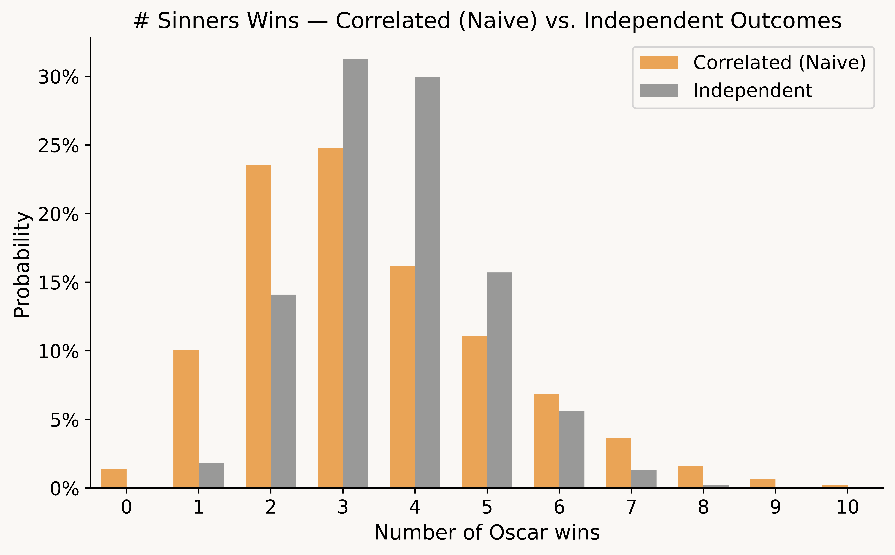
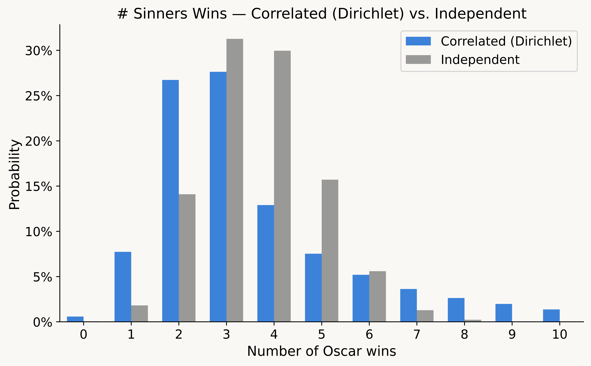

# Oscars Correlations

Consider three different questions you could ask when forecasting the Academy Awards:

1. What is the probability that film X wins award Y? (E.g., "Sinners" has a ~9% chance to win Best Picture). 
2. Assuming that film X wins award Z, what is the probability it also wins award Y? (E.g., assuming Sinners wins Best Actor, it has an ~30% chance to then win Best Picture). 
3. What is the probability that film X wins at least N awards? 

Question (1) is the fundamental task of Oscars prognostication. There is no shortcut here—forecasters need to use a patchwork of imperfect evidence (e.g., precursors, reporting, critical acclaim, box office) to predict the preferences of Academy voters.

Question (2) is meaningfully different because Oscars outcomes are *correlated*. If I could peek into the future and see that Michael B. Jordan won Best Actor for "Sinners" (current probability ~11%, i.e., a large upset), I would conclude that we had previously underestimated the film's popularity with the Academy, increasing my confidence in its Best Picture chances (e.g., from 9% -> 30%).

This post builds a model for question (3) using the answers to (1) and (2). In other words, how can we model the full probability distribution for a film's number of wins, given the probability that a film wins each individual award and the level of correlation between the outcomes?
## Naive model

Let $p_{i,j}$ denote the probability that film $i \in C_j$ wins category $j$. We want to generate a set of winners (one for each category) as a single simulated "Oscars night". If we repeat this process many times, we can answer questions like "What is the probability that OBBA wins 6 or more Oscars?". 

The simplest way is to separately generate the winners for each category.

**Model #1: Independent Outcomes**

1. **Generate winners**: Select winners independently in each category using the $p_{i,j}$ probabilities

Under this approach, the winners are uncorrelated—i.e., in the simulations where OBBA wins Best Actor, it is no more or less likely to win Best Picture. This seems implausible.

Instead, how can we model what it means for winners to be "correlated"? One approach is to say that for each film, we may be under or overestimating its support among the Academy, meaning its true chance to win is simultaneously higher or lower in each of its categories.

To operationalize this, the simulation needs additional steps: generate a random $z_i$ as the "underestimation factor" for each film, use the $z_i$ to update the probabilities (from $p_{i,j} \to p_{i,j}'$), and then independently generate the winners using the updated $p_{i,j}'$ probabilities (which now encode the desired correlation).  

**Model #2: Correlated Outcomes (Naive)**

1. **Generate underestimation factors**: Generate a random $z_i \sim N(0, \sigma^2)$ for each film (where $\sigma$ is a scale parameter we choose to reflect the strength of the correlations)—roughly, "how much we underestimated its support".
2. **Update probabilities**: Calculate the updated $p_{i,j}'$ for each film & category, by adding the underestimation factor to the original probability. That is, calculate $\alpha_{i,j} = p_{i,j} + z_i$, and then normalize the $\alpha_{i,j}$ so the probabilities sum to one:
$$p_{i,j}' = \frac{\alpha_{i,j}}{\sum_{f \in C_j} \alpha_{f,j}}.$$
3. **Generate winners**: Select winners independently in each category using the updated $p_{i,j}'$ probabilities.

When $z_i > 0$, we underestimated film $i$'s support among the Academy, and it has a better chance to win in *each* of its categories (inducing the desired correlation). Under independent outcomes, Sinners is quite likely to win around 4 awards (as it has many wholly independent shots at winning awards), whereas with these correlations, Sinners has a more plausible shot to win 5+ or 0.[1]
                                                                                                                                            
However, this approach is fatally flawed, as it fails to preserve the correct *marginal probabilities*. Once we normalize the probabilities, it asymmetrically advantages longshot nominees (e.g., a film starting at 1% can be hugely benefitted from its $z_i$ but its probability can't go much lower). Thus, F1 & Frankenstein (two distant longshots) are now vastly more likely to win Best Picture than the probabilities we assumed as input.

This is a non-starter, and fixing it requires more than a change of scale. These $z_i$ perturbations are on a flat (percentage point) scale—a +5% shift matters much more at 1% than 70%. But updating the probabilities using the log-odds or using a different $z_i$ distribution won't fully fix the issue either. Instead, we need a way to perturb the probabilities on the correct scale so the marginal probabilities are preserved.
## How can we fix this?

To fix this, we need three ingredients: a distribution that preserves marginal probabilities after normalization (Dirichlet), a way to construct it from simpler parts (Gamma variables), and a trick to correlate them across categories (the inverse CDF trick).

**Setup**: The winner of each category is a draw from a [Multinomial distribution](https://en.wikipedia.org/wiki/Multinomial_distribution) (with $N=1$). The parameters for a Multinomial distribution are a vector of probabilities that sum to 1. Thus, for each category, we want to generate a vector of probabilities $p_{i,j}'$ that we can use as the input to the Multinomial, with **two constraints**:

1. The updated probabilities have the same expected value as the input probabilities: $\mathbb{E}[p_{i,j}']=p_{i,j}$.
2. The updated probabilities sum to 1: $\sum_{i \in C_j} p_{i,j}' = 1$.

This is non-trivial, because perturbing $p_{i,j}$ (to induce correlation) tends to violate constraint (2) unless you normalize, in which case it tends to violate constraint (1). But there's a distribution with exactly these properties: the [Dirichlet distribution](https://en.wikipedia.org/wiki/Dirichlet_distribution).

**Property #1:** If $\mathbf{Y} \sim \text{Dirichlet}(a_1, \ldots, a_N)$, then: (a) $\sum_{i=1}^N Y_i = 1$ and (b) $\mathbb{E}[Y_i] = a_i / (\sum_{j=1}^N a_j)$.

Thus, if we set $a_i = p_{i,j}$ (the input probabilities), then $\mathbb{E}[Y_i] = p_{i,j}$, satisfying the constraints. Further, it's straightforward to generate Dirichlet random variables:

**Property #2:** If you generate $N$ independent random variables $X_i \sim \text{Gamma}(a_i, 1)$ and normalize them as $Y_i = X_i / (\sum_{j=1}^N X_j)$, then the vector $\mathbf{Y}$ has distribution $\mathbf{Y} \sim \text{Dirichlet}(a_1, \ldots, a_N)$.

Thus, we need to generate Gamma random variables that are: (1) independent within each category, (2) correlated between categories for the same film. This can be handled via the [inverse CDF trick](https://en.wikipedia.org/wiki/Inverse_transform_sampling):

* For each movie $i$, generate a uniform random variable $u_i$.
* For each movie $i$ and category $j$, define a Gamma distribution with mean $p_{i,j}$.
* Generate $\alpha_{i,j}$ as the $u_i$ percentile draw from that Gamma distribution.

For example, if $u_i = 0.90$ for OBBA, then its $\alpha_{i,j}$ are each the 90th percentile of their Gamma distribution (and thus, they will all be substantially above their mean). This is an elegant solution: within each category, the Gamma variables are independent, but across different categories, the same films are now correlated (while preserving their unique mean).[2]

Finally, note that the above properties hold if we instead multiply the means of the Gamma distributions ($p_{i,j}$) by the same constant $k$ (as it cancels in the normalization step). This is helpful because we can tune $k$ to adjust the *strength* of the correlation we want to induce (discussed further below).
## Fixed model

If we put it all together, it looks like this:

**Model #3: Correlated Outcomes (Correct)**

1. **Generate underestimation factors**: Generate $u_i \sim \text{Uniform}(0, 1)$ for each film $i$. 
2. **Update probabilities**: Calculate $\alpha_{i,j} = F^{-1}_{\text{Gamma}}(u_i; k \cdot p_{i,j}, 1)$ . Convert the $\alpha_{i,j}$ to probabilities via normalization (so they sum to one):
$$p_{i,j}' = \frac{\alpha_{i,j}}{\sum_{f \in C_j} \alpha_{f,j}}.$$
3. **Generate winners**: Select winners independently in each category using the updated $p_{i,j}'$ probabilities.

This now preserves the correct marginal probabilities:

## How strong should the correlation be?

The final choice for the model is $k$, which determines the strength of the correlation: $\alpha_{i,j} = F^{-1}_{\text{Gamma}}(u_i;\; \text{shape}=k \cdot p_{i,j})$. The strength of the correlation is an *input* to the model—we need to tweak $k$ until specific conditional probability outputs seem plausible.

To calibrate $k$, consider the impact of a major upset in Best Actor on the Best Picture odds:

* $p(\text{Event})$: original probability that "Sinners" wins Best Actor.
* $p(\text{BP})$: original probability that "Sinners" wins Best Picture.
* $p(\text{BP} \mid \text{Event})$: probability that "Sinners" wins Best Picture, once we condition on "Sinners" winning Best Actor.

| Correlation Strength | $p(\text{Event})$ | $p(\text{BP})$ | $p(\text{BP} \mid \text{Event})$ |
| -------------------- | ----------------- | -------------- | -------------------------------- |
| $k=0.5$              | 11%               | 9%             | 43%                              |
| $k=1$                | 11%               | 9%             | 37%                              |
| $k=2$                | 11%               | 9%             | 30%                              |
To my eye, the probability updates under $k=0.5$ and $k=1$ are a bit too severe, whereas $k=2$ looks about right, so I'll use $k=2$ going forward. This is ultimately a subjective choice—given the size of this upset in Best Actor, some might believe that it is hugely informative about the Best Picture race, whereas others might think these are separate categories and we shouldn't overreact.

It's deceptively hard to validate the choice of $k$, beyond checking our intuition for specific examples. A dataset of historical Oscars results can't tell you much about the correlations (e.g., "did 'Titanic' win 11 Oscars because the outcomes were correlated, or because its chance in each individual category was high?"). The "correlation" in this model is not an intrinsic property of the awards; rather, it refers to our *subjective* beliefs about forecasting Academy voters (and how over and underperformance relative to our expectations tends to be a film-wide property).

## Results

Returning to the original question, we can estimate the full probability distribution for how many Oscars "Sinners" will win: 

"Sinners" has 16 total nominations, but it's a favorite in just 3 categories (Score, Original Screenplay, & Casting). Under independence, it's extremely likely to win 3 or 4 Oscars, in large part because it has many independent shots at an upset. Under the correlated model, we get more plausible results—there's a meaningful chance that "Sinners" is much weaker (e.g., winning just one) *or* much stronger (e.g., winning 7+) than we expect. 

This reflects that the Oscars are a single night that we are trying to predict (where our assumptions might be systematically wrong), not a series of independent coin flips.

[1]. Input probabilities for this blog post queried from Kalshi on March 1, 2026.

[2]. The acting categories can have multiple nominees from the same film, violating the independence assumption required for the Gamma-Dirichlet relationship. In practice, the impact is mild (multiple nominees are rare and typically one or all are longshots).